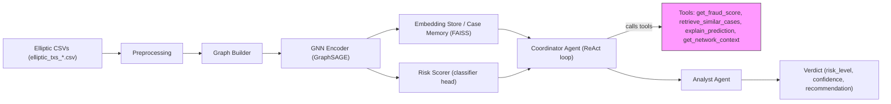

# Agentic AML System

An intelligent Anti-Money Laundering (AML) system that combines Graph Neural Networks (GNN) with a **Hybrid 2-Agent Architecture** for explainable, autonomous fraud detection on blockchain transactions.

## 🎯 Overview

This project implements a novel approach to AML by:
1. **GNN-based Detection**: Using GraphSAGE/GAT models to detect suspicious transactions in the Bitcoin network
2. **Case Memory**: Storing historical fraud cases with explanations
3. **Hybrid 2-Agent Pipeline**: Autonomous investigation with Coordinator + Analyst agents
4. **ReAct Pattern**: Reason-Act-Observe loop for dynamic tool selection and evidence gathering
5. **Structured Verdicts**: Risk levels, confidence scores, and actionable recommendations

## 🏗️ Architecture

```
┌─────────────────────────────────────────────────────────────────┐
│                      Input Transaction                          │
└─────────────────────┬───────────────────────────────────────────┘
                      │
                      ▼
┌─────────────────────────────────────────────────────────────────┐
│                  COORDINATOR AGENT                              │
│                  (ReAct Pattern)                                │
│                                                                 │
│  THOUGHT → What information do I need?                          │
│  ACTION  → get_fraud_score | retrieve_similar_cases |           │
│            explain_prediction | get_network_context             │
│  OBSERVE → Process tool output, plan next step                  │
│                                                                 │
│  Iterates until sufficient evidence gathered                    │
└─────────────────────┬───────────────────────────────────────────┘
                      │ Evidence Package
                      ▼
┌─────────────────────────────────────────────────────────────────┐
│                    ANALYST AGENT                                │
│                                                                 │
│  Input: All evidence from investigation                         │
│  Output:                                                        │
│    • Risk Level (CRITICAL/HIGH/MEDIUM/LOW)                      │
│    • Confidence Score (0-100%)                                  │
│    • Recommendation (FLAG_IMMEDIATE/INVESTIGATE/MONITOR/CLEAR)  │
│    • Detailed reasoning with key factors                        │
└─────────────────────────────────────────────────────────────────┘
```

### Tool Architecture

```
┌─────────────────────────────────────────────────────────────────┐
│                       AML Tools                                 │
├─────────────────────────────────────────────────────────────────┤
│  get_fraud_score      │ GNN prediction + confidence score       │
│  retrieve_similar_cases│ FAISS k-NN search for similar fraud    │
│  explain_prediction   │ GNNExplainer feature importance         │
│  get_network_context  │ Neighbor analysis and risk propagation  │
│  lookup_case          │ Historical case details by ID           │
│  get_transaction_features│ Raw feature extraction               │
└─────────────────────────────────────────────────────────────────┘
```

Mermaid architecture diagram (source: `ARCHITECTURE.mmd`):



## 📁 Project Structure

```
aml-agentic-approach/
├── configs/
│   ├── model.yaml          # GNN model configuration
│   ├── training.yaml       # Training hyperparameters
│   └── rag.yaml            # RAG pipeline settings
├── data/
│   └── elliptic_bitcoin_dataset/   # (not tracked in git)
├── notebooks/
│   ├── 01_eda.ipynb                # Exploratory data analysis
│   ├── 02_gcn_baseline.ipynb       # GNN model training
│   ├── 03_case_memory.ipynb        # Case memory construction
│   ├── 04_rag_pipeline.ipynb       # RAG pipeline demo
│   └── 05_agentic_pipeline.ipynb   # Agentic investigation demo
├── src/
│   ├── agents/                     # 🆕 Agentic components
│   │   ├── tools.py               # Tool wrappers for GNN/FAISS
│   │   ├── coordinator.py         # Coordinator Agent (ReAct)
│   │   ├── analyst.py             # Analyst Agent (Verdicts)
│   │   └── orchestrator.py        # Main pipeline orchestrator
│   ├── llm/                        # 🆕 LLM client
│   │   └── client.py              # OpenAI/Anthropic/Ollama
│   ├── data/
│   │   ├── elliptic_loader.py
│   │   └── graph_builder.py
│   ├── models/
│   │   ├── graphsage.py
│   │   └── gat.py
│   ├── explainer/
│   │   └── gnn_explainer.py
│   ├── memory/
│   │   ├── case_store.py
│   │   └── case_selector.py
│   ├── retrieval/
│   │   ├── faiss_index.py
│   │   └── retriever.py
│   ├── prompts/
│   │   ├── icl_constructor.py    # In-context learning prompts
│   │   └── templates.py          # Prompt templates
│   ├── pipeline/
│   │   └── inference.py          # End-to-end inference
│   ├── utils/
│   │   ├── metrics.py            # Evaluation metrics
│   │   └── visualization.py      # Plotting utilities
│   └── train.py                  # Training script
└── README.md
```

## 🚀 Installation

### Prerequisites
- Python 3.9+
- CUDA (optional, for GPU acceleration)

### Setup

```bash
# Clone the repository
git clone https://github.com/bhanuprakashyr/aml-agentic-approach.git
cd aml-agentic-approach

# Create virtual environment
python -m venv venv
source venv/bin/activate  # On Windows: venv\Scripts\activate

# Install dependencies
pip install -r requirements.txt
```

### Dependencies
- PyTorch
- PyTorch Geometric
- FAISS
- NumPy, Pandas, Scikit-learn
- PyYAML
- Matplotlib, Seaborn

## 📊 Dataset

This project uses the [Elliptic Bitcoin Dataset](https://www.kaggle.com/datasets/ellipticco/elliptic-data-set), which contains:
- **203,769** Bitcoin transactions
- **234,355** directed payment flows (edges)
- **166** node features (timestamps + transaction features)
- Labels: **illicit** (4,545), **licit** (42,019), **unknown** (157,205)

### Download Data
1. Download from [Kaggle](https://www.kaggle.com/datasets/ellipticco/elliptic-data-set)
2. Extract to `data/elliptic_bitcoin_dataset/`

## 🎮 Usage

### Training the GNN Model

```python
from src.train import train_model
from src.data.elliptic_loader import EllipticDataset
from src.data.graph_builder import build_pyg_graph

# Load and prepare data
dataset = EllipticDataset("data/elliptic_bitcoin_dataset")
graph = build_pyg_graph(dataset)

# Train model
model = train_model(graph, config_path="configs/training.yaml")
```

### Running Inference

```python
from src.pipeline.inference import AMLInferencePipeline

# Initialize pipeline
pipeline = AMLInferencePipeline(
    model_path="checkpoints/best_model.pt",
    config_path="configs/rag.yaml"
)

# Get prediction with explanation
result = pipeline.predict(transaction_id=12345)

print(f"Fraud Probability: {result['probability']:.2%}")
print(f"Explanation: {result['explanation']}")
print(f"Similar Cases: {result['similar_cases']}")
```

### 🤖 Agentic Investigation (NEW)

```python
from src.agents import AMLOrchestrator

# Initialize agentic pipeline
orchestrator = AMLOrchestrator(
    model=model,
    data=graph,
    case_memory=case_memory,
    faiss_index=faiss_index,
    llm_provider="ollama",  # or "openai", "anthropic"
    verbose=True
)

# Run autonomous investigation
result = orchestrator.investigate(node_idx=12345)

# View verdict
print(f"Risk Level: {result.verdict.risk_level}")
print(f"Confidence: {result.verdict.confidence:.0%}")
print(f"Recommendation: {result.verdict.recommendation}")
print(f"Reasoning: {result.verdict.reasoning}")
```

## 🧠 Model Details

### GraphSAGE
- **Aggregator**: Mean/LSTM/Pool
- **Hidden dimensions**: 128
- **Number of layers**: 2
- **Dropout**: 0.5

### Graph Attention Network (GAT)
- **Attention heads**: 8
- **Hidden dimensions**: 128
- **Number of layers**: 2
- **Dropout**: 0.6

## 📈 Evaluation Metrics

- **Precision / Recall / F1-Score**
- **AUC-ROC**
- **Average Precision (AP)**
- **Illicit F1** (primary metric for imbalanced data)

## 🔮 Future Work

- [ ] Integration with LLM APIs for enhanced explanations
- [ ] Real-time transaction monitoring
- [ ] Multi-chain support (Ethereum, etc.)
- [ ] Active learning for continuous improvement
- [ ] Dashboard for visualization

## 📄 License

This project is for educational and research purposes.

## 🙏 Acknowledgments

- [Elliptic](https://www.elliptic.co/) for the Bitcoin dataset
- PyTorch Geometric team
- FAISS by Meta AI
